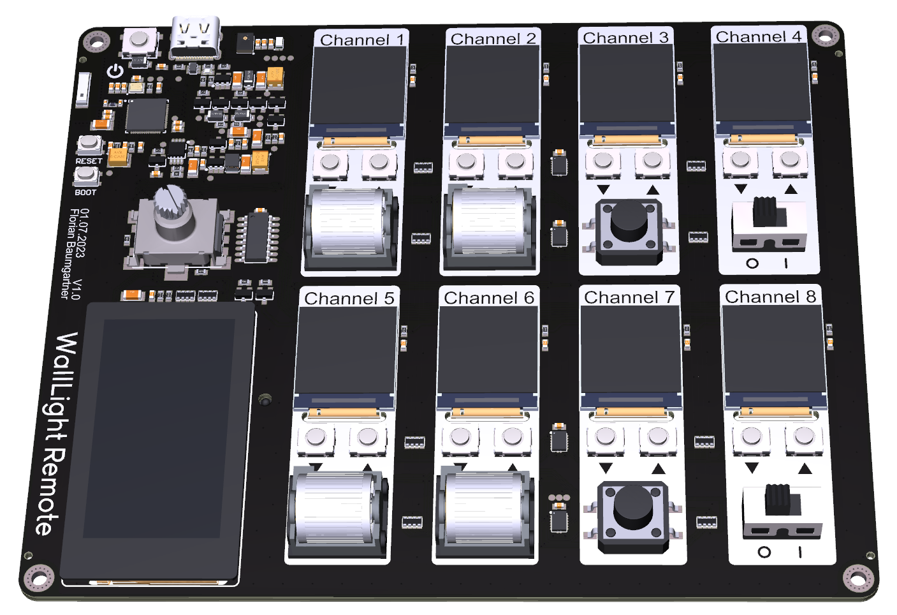
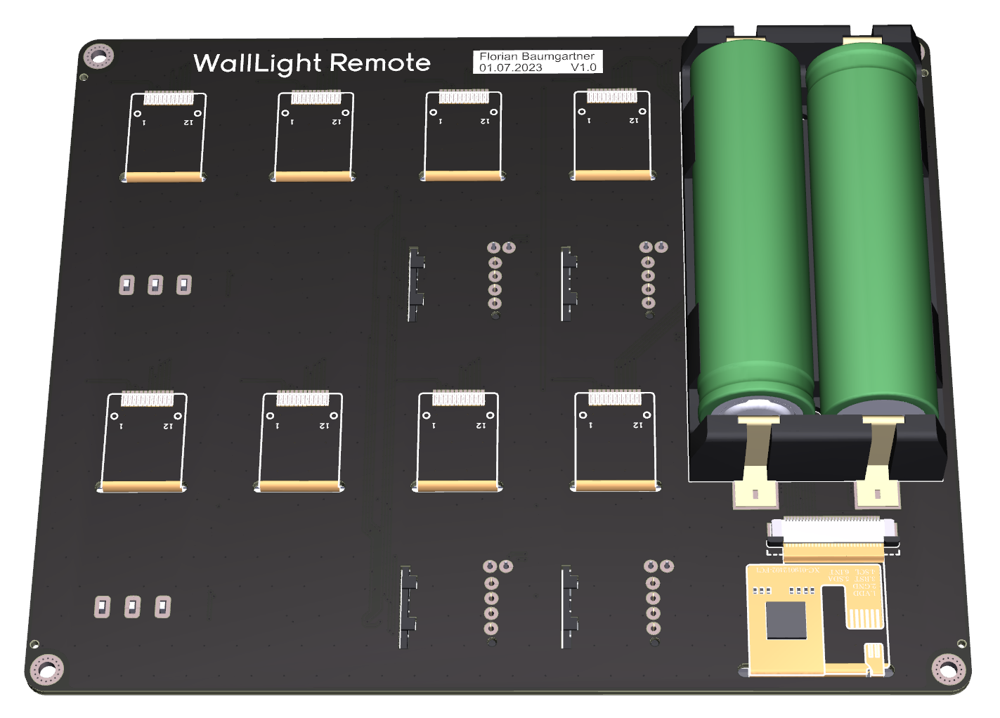

# WallLight Remote - Hardware Information

The WallLight Remote is an advanced hardware based on the ESP32-S3 chip, with integrated flash memory (8 MB). It's a flexible system that allows the user to control 8 individual channels of the WallLight system. The design has been made using Altium Designer.

## Features

- **Eight Dedicated Channels:** Each channel features a dedicated TFT display and two buttons to control the channel ID.

- **Various Control Inputs:** Channels 1, 2, 5, 6 feature a roller encoder. Channels 3 and 7 feature a tactile button, while channels 4 and 8 have a slide switch.

- **1.9" LCD Touch Screen:** Additional control is possible through the touch screen, providing a versatile interface for users.

- **Pushable Rotary Encoder:** Provides another layer of user control, increasing the adaptability of the WallLight Remote.

- **MEMS Microphone:** Allows for music control and possible future developments.

- **RGBW Brightness/Color Sensor:** Enables color and brightness sensing, allowing for more sophisticated lighting control.

- **Power Source:** The device is powered by two 18650 Li-Ion cells, located at the back side of the PCB.

- **USB-C Port:** For programming the device and charging the Li-Ion cells.

## Getting Started

You can program the WallLight Remote using the provided USB-C port. After programming, this port can also be used for charging the device.

The WallLight Remote is an open hardware project. If you're interested in contributing or making your own modifications, please respect the license and share your changes with the community. 

For more information about the WallLight system and other devices in the WallLight ecosystem, contact Florian Baumgartner.
